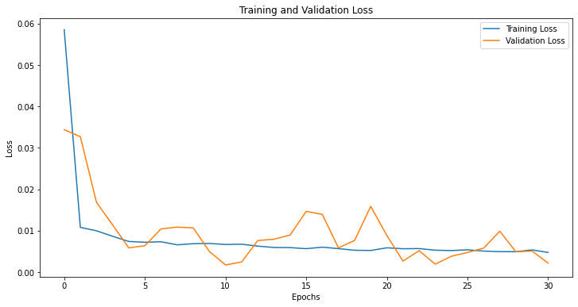
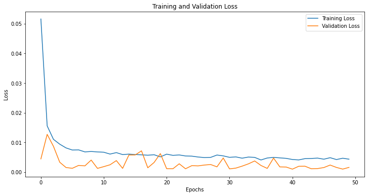
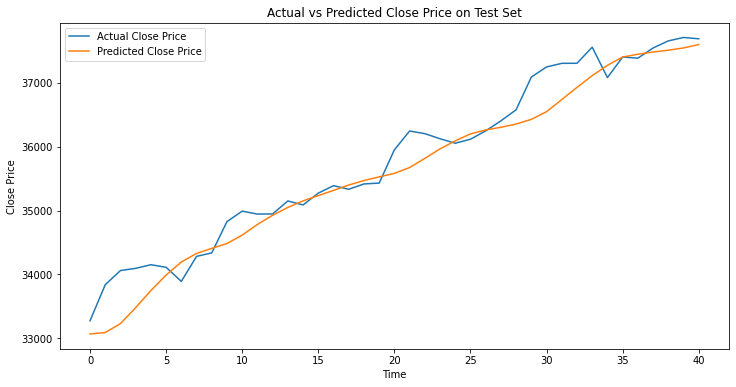
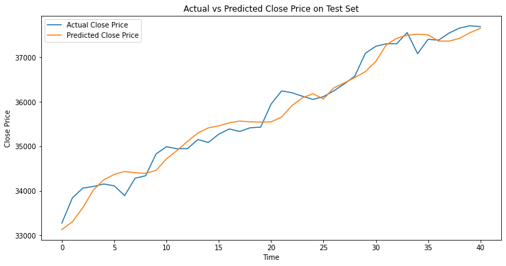
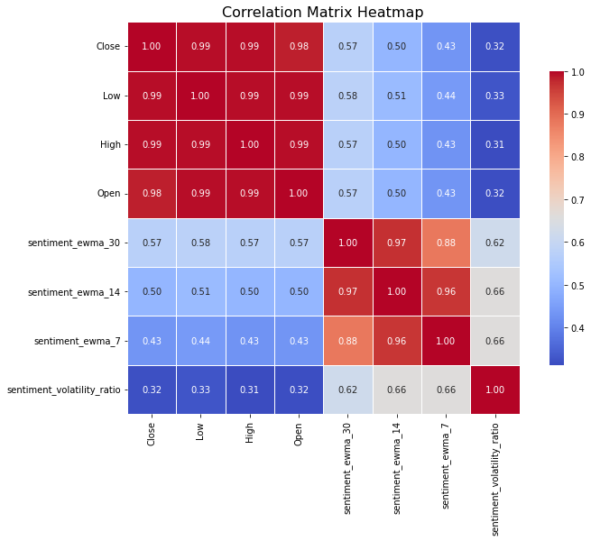

# Stock Index Price Prediction Using Sentiment Analysis

> **MSc Data Science Dissertation** — University of Nottingham, November 2024  
> **Author:** Muhammed Razi Abdul Shukoor

<p align="center">
  
  
  
  
</p>

---

## 📖 Executive Summary

This repository contains the complete codebase and findings of my master's thesis, which investigates whether integrating **financial news sentiment** into a deep learning model can improve the prediction accuracy of the **Dow Jones Industrial Average (DJIA)** closing price.

By combining traditional DJIA market data with **volume-weighted sentiment scores** derived from over 24,000 scraped financial headlines, this project demonstrates a significant improvement in predictive performance over baseline models. An **LSTM neural network** trained on the combined feature set reduced Test Root Mean Square Error (RMSE) by **~25%** and improved Test R² from **0.93 to 0.96**. 

Furthermore, the sentiment-enhanced model demonstrated superior convergence stability, effectively escaping the shallow local minima that plagued the baseline model.

---

## 🎯 Problem Statement

Traditional stock prediction models often rely solely on historical price and volume data (OHLCV). However, financial markets are highly sensitive to public sentiment, breaking news, and macroeconomic announcements. 

Relying entirely on historical prices ignores the fundamental catalysts that drive market volatility. This thesis addresses this gap by quantifying textual financial news into numerical sentiment scores and fusing them with historical price data to create a more robust, market-aware predictive model.

---

## 🔬 Methodology

### 1. Data Collection & Preprocessing
- **Market Data:** Daily Open, High, Low, Close, and Volume data for the DJIA (2022–2023) fetched via `yfinance`.
- **Financial News:** Scraped **24,305** headlines relating to the 30 DJIA component stocks from **Markets Insider** (via `BeautifulSoup`) and the **Financial Times** (via headless `Selenium`).

### 2. Sentiment Quantification
- Processed the scraped headlines using the **VADER (Valence Aware Dictionary and sEntiment Reasoner)** NLP lexicon to generate a compound sentiment score [-1, 1] for each article.
- Calculated a **Volume-Weighted Daily Sentiment** metric. This ensures that sentiment regarding highly traded companies heavily influences the daily aggregate, while thinly traded companies have a muted impact.

### 3. Feature Engineering
Constructed advanced temporal features to capture short and medium-term market psychology:
*   **EWMAs (Exponentially Weighted Moving Averages):** 3, 7, 14, and 30-day sentiment EWMAs.
*   **Sentiment Volatility:** Rolling 5-day standard deviation of sentiment to capture uncertainty.
*   **Momentum & Lags:** Cumulative day-on-day sentiment changes and lagged indicators (1-3 days).
*   **Volatility Ratios:** `sentiment_ewma_30 / sentiment_volatility` to identify periods of high-conviction directional sentiment.

### 4. Deep Learning Architecture
Developed an **LSTM (Long Short-Term Memory)** network capable of modeling the sequential dependencies in financial time series.
- **Topology:** LSTM (128 units) ➔ Dropout (0.2) ➔ Dense (1)
- **Hyperparameters:** Adam optimizer, MSE loss, 60-day lookback window, batch size of 16.

---

## 📈 Key Results & Accuracy Analysis

The inclusion of sentiment features fundamentally improved the model's ability to map the underlying market dynamics.

### Baseline Model (Price Features Only) vs. Sentiment-Enhanced Model

| Metric | Baseline LSTM (Price Only) | Sentiment LSTM | Improvement |
|---|---|---|---|
| **Train RMSE** | 614.20 | 454.12 | **−26.1%** |
| **Test RMSE** | 337.48 | 253.78 | **−24.8%** |
| **Train MAE** | 462.72 | 352.41 | **−23.8%** |
| **Test MAE** | 247.70 | 198.47 | **−19.9%** |
| **Train R²** | 0.81 | 0.90 | **+11.1%** |
| **Test R²** | 0.93 | 0.96 | **+3.2%** |

### Convergence & Loss Curves

The baseline model struggled with convergence, plateauing early (around epoch 11) in a shallow local minimum. The sentiment-enhanced model demonstrated a much smoother optimization trajectory, learning continuously until epoch 41 without severe overfitting.

<p align="center">
  <b>Baseline Model Loss</b> &nbsp;&nbsp;&nbsp;&nbsp;&nbsp;&nbsp;&nbsp;&nbsp;&nbsp;&nbsp;&nbsp;&nbsp;&nbsp;&nbsp;&nbsp;&nbsp;&nbsp;&nbsp;&nbsp;&nbsp;&nbsp;&nbsp;&nbsp;&nbsp;&nbsp;&nbsp;&nbsp;&nbsp;&nbsp;&nbsp;&nbsp;&nbsp;&nbsp;&nbsp;&nbsp;&nbsp;&nbsp;&nbsp;&nbsp;&nbsp;&nbsp;&nbsp;&nbsp;&nbsp;&nbsp;&nbsp;&nbsp;&nbsp;&nbsp;&nbsp; <b>Sentiment-Enhanced Model Loss</b><br>
  
  
</p>

### Actual vs. Predicted Price

The sentiment-enhanced model tightly tracks the actual DJIA close price, exhibiting significantly less variance and lag during sharp directional changes compared to the baseline.

<p align="center">
  <b>Baseline Prediction Accuracy</b> &nbsp;&nbsp;&nbsp;&nbsp;&nbsp;&nbsp;&nbsp;&nbsp;&nbsp;&nbsp;&nbsp;&nbsp;&nbsp;&nbsp;&nbsp;&nbsp;&nbsp;&nbsp;&nbsp;&nbsp;&nbsp;&nbsp;&nbsp;&nbsp;&nbsp;&nbsp;&nbsp;&nbsp;&nbsp;&nbsp;&nbsp;&nbsp;&nbsp;&nbsp;&nbsp;&nbsp;&nbsp;&nbsp;&nbsp;&nbsp; <b>Sentiment-Enhanced Prediction Accuracy</b><br>
  
  
</p>

### Exploratory Data Analysis (EDA)

The correlation matrix below illustrates the positive correlations between the DJIA Closing price and the engineered sentiment EWMAs, confirming that sustained positive news sentiment is historically indicative of upward price action.

<p align="center">
  
</p>

---

## 🛠 Repository Structure

```text
├── data/                                        # Dataset files
│   └── correlationimp.csv                       # The raw scraped headlines dataset (24,305 articles)
├── images/                                      # Exported plots and performance diagrams
├── notebooks/                                   # Jupyter notebooks for data collection and modelling
│   ├── 01_data_collection.ipynb                 # Web scraping architecture (Requests, BeautifulSoup, Selenium)
│   └── 02_feature_engineering_and_prediction.ipynb # Sentiment scoring, EWMA features, and LSTM modelling
├── README.md
└── .gitignore
```

---

## 🚀 Reproducing the Study

### Prerequisites

```bash
pip install requests beautifulsoup4 lxml selenium pandas numpy yfinance \
            vaderSentiment scikit-learn tensorflow matplotlib seaborn
```

> **Selenium** requires a compatible **ChromeDriver** installed and available on your `PATH`. See [ChromeDriver downloads](https://chromedriver.chromium.org/downloads).

### Steps

1. **Clone the repository**
   ```bash
   git clone https://github.com/<your-username>/stock-index-sentiment-analysis.git
   cd stock-index-sentiment-analysis
   ```

2. **Run Notebook 1** *(Optional — `correlationimp.csv` is already included)*  
   Open `01_data_collection.ipynb` and execute all cells. This will scrape headlines dynamically and overwrite `correlationimp.csv`.

3. **Run Notebook 2**  
   Open `02_feature_engineering_and_prediction.ipynb` and run all cells to reproduce the sentiment analysis, feature engineering, and LSTM evaluation.

---


*For an in-depth exploration of the methodology, mathematics, and literature review, please refer to the complete **Dissertation PDF** included in this repository.*
